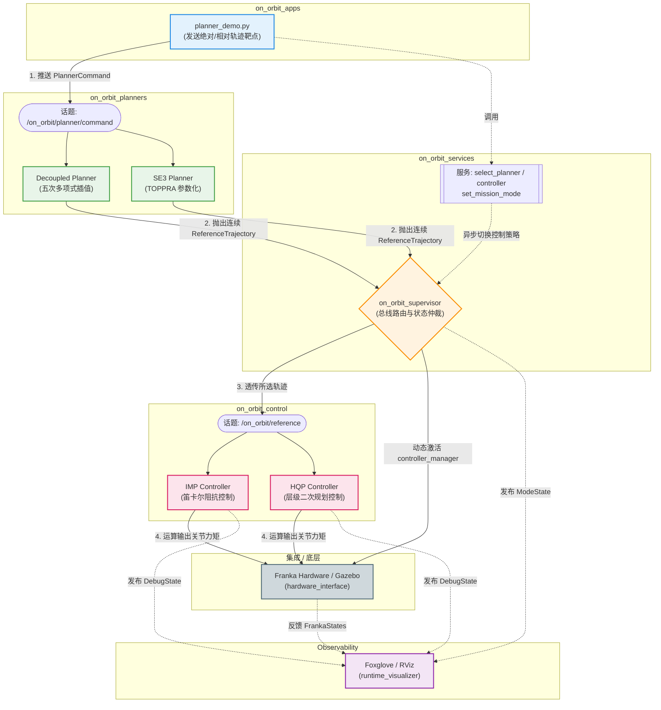

# 架构总览

Franka On-Orbit 2.0 系统在设计上遵循“高内聚、低耦合”的模块化原则。各核心功能由独立包承载，并通过标准的 ROS1 消息流与服务调用贯穿始终。

## 系统链路数据流向

整个系统的运行可概括为自上而下的漏斗式计算：从上层用户意图出发，经由统一接口下放给特定的规划器，再将规划点阵通过路由中枢无缝派发至不同力矩控制器，最终下发至物理接口。

以下为全景信息流拓扑图：

---

## 模块分工解析

各分层包职能说明如下（与拓扑图对应）：

### 1. 应用入口层 (`on_orbit_apps`)
外部调用接口与实验脚本所在层。
* **主要职责**：任务编排与参数转化。通过 `planner_demo.py` 或 `experiment_runner.py` 发起实验，将目标位姿处理为 `on_orbit_msgs/PlannerCommand` 消息进行发布。

### 2. 位姿规划层 (`on_orbit_planners`)
接收离散位姿目标并负责轨迹生成与插值。
* **共同通信特征**：订阅 `PlannerCommand`，发布时间序列的 `ReferenceTrajectory`。
* **现有后端**：
  * `decoupled`：五次多项式定长插值，适配 `imp` 控制器。
  * `se3`：基于 TOPPRA 的时间最优参数化轨迹生成，适配 `hqp` 控制器。

### 3. 路由仲裁层 (`on_orbit_services`)
负责状态机管理与话题路由。
* **Supervisor 节点**：订阅所有 Planner 的参考轨迹与状态，根据当前服务请求（如 `select_planner` 或 `select_controller`）选择对应轨迹，并转发至统一话题 `/on_orbit/reference`。同时，通过调用底层 `controller_manager` 服务实现对应控制器插件的加载、启动与停用。

### 4. 实时控制层 (`on_orbit_control`)
实时力矩计算逻辑层（默认 1kHz 执行频率）。
* **公共数学库**：`lib_class` 提供操作空间惯量计算、接触力估计、零空间映射等代数计算支持。
* **控制器插件**：继承自 `BaseController` 基类。控制器严格按照系统时钟提取 `/on_orbit/reference` 话题内对应时间戳的采样点，进行误差比对并下发关节力矩，内部不保留轨迹缓存。

### 5. 接口统一层 (`on_orbit_msgs`)
定义系统内部自定义消息与服务。
* **通信封装**：核心跨层通信数据结构为 `PlannerCommand` (规划输入) 与 `ReferenceTrajectory` (控制输入)，从而避免层级之间的直接代码依赖。

### 6. 配置集成层 (`on_orbit_bringup`)
参数配置与启动文件（Launch）组织。
* **分级调网**：包含 `hardware_stack.launch` 等底层入口，以及 `closed_loop_experiment.launch` 等高层入口。真机环境部署与 Gazebo 仿真均共享核心控制逻辑，仅依据参数引入不同的底层硬件。

## 故障排查（按数据流）

根据数据流向，系统异常可按层级自顶向下排查：
* **目标指令下发无响应**：检查 `on_orbit_apps` 脚本向话题发布指令的功能是否正常运行。
* **缺少轨迹计算或报数学错误**：排查 `on_orbit_planners` 当中目标位姿可达性以及计算阈值保护。
* **底层无反应但规划已有结果**：检查 `on_orbit_services` 中 Supervisor 的状态机流转情况，判断其转发器是否停用。
* **运动产生异常抖动与限位极点**：检查 `on_orbit_control` 端内控参数（刚度、阻尼），或核查解算矩阵存在的奇异可能。
