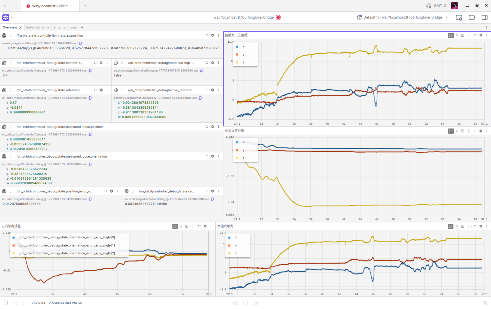

<div class="hero-grid">
  <div class="hero-copy">
    <p class="hero-eyebrow">Franka On-Orbit 2.0</p>
    <h1 class="hero-title" style="margin-top: 0;">Franka 实验框架</h1>
    <p class="hero-lead">提供从容器环境启动、ROS1 算法栈编译、自动闭环仿真到一键生成科研论文图表的完整工作流。</p>
    <div class="hero-actions">
      <a href="#_1" class="md-button md-button--primary">快速开始</a>
      <a href="architecture/" class="md-button">架构总览</a>
    </div>
  </div>
  <div class="hero-preview">
    <div class="hero-panel">
      
      <p class="panel-caption">SE(3) 跟踪与 HQP 实际响应</p>
    </div>
  </div>
</div>

---

## 快速开始

### 1. 准备环境变量

复制环境变量模板，并按实际网络环境修改 `.env` 中的关键变量（例如 `FRANKA_ROBOT_IP`、`ROS_MASTER_URI` 等）。通常第一次配置后无需再变动。

```bash
cp .env.example .env
```

### 2. 启动并进入实验容器

所有依赖与编译工具链均已内置于配置好的 Docker 镜像中。执行以下命令拉起并进入容器：

```bash
docker compose up --build -d
docker exec -it ros1-franka bash
```

### 3. 编译工作区

在容器终端中依次执行，完成 ROS1 工作区的编译与刷新：

```bash
source /opt/ros/noetic/setup.bash
cd /workspace
catkin_make
source /workspace/devel/setup.bash
```

<br>

### 4. 关节空间初始化（推荐）

在启动闭环实验前，建议先将机械臂归位至标准构型，避免后续笛卡尔空间实验在奇异姿态附近起步。

需先在一个终端中拉起手动实验后端：
```bash
roslaunch on_orbit_bringup manual_experiment.launch
```

在另一个终端中，通过 `joint_posture_demo.py` 发送关节目标。支持直接传入关节角或使用 YAML 文件：

=== "直接指定关节角"
    ```bash
    rosrun on_orbit_apps joint_posture_demo.py \
      _joint_position:=[0.0,-0.785,0.0,-2.356,0.0,1.571,0.785]
    ```

=== "从 YAML 文件加载"
    ```bash
    rosrun on_orbit_apps joint_posture_demo.py \
      _joint_position_file:=/workspace/src/on_orbit_apps/config/home_posture.yaml
    ```

归位完成后，该脚本会自动将控制器切回原先的 `imp` 或 `hqp`，随后可关闭手动实验后端，开始正式闭环。

<br>

### 5. 启动闭环仿真实验

下发指令将自动启动 ROS Master、底层控制器以及规划器（SE3, Decoupled 等）。
运行期间会进行多套架构的自动序列切换，并使用 `rosbag` 进行全景数据抓取，保存至 `/workspace/closed/` 目录下。

<figure markdown="span" style="margin-top: 1rem; margin-bottom: 1.5rem; display: block; text-align: center;">
  
</figure>

```bash
roslaunch on_orbit_bringup closed_loop_experiment.launch
```

??? tip "⚙️ 核心设定：闭环轨迹与约束在哪修改？"
    `closed_loop_experiment.launch` 会根据内部状态机的执行阶段，自动加载 `src/on_orbit_apps/config/` 目录下的特征参数文件（如 `closed_loop_planner_demo_se3.yaml`）。
    
    这些 YAML 文件定义了：
    - **`waypoints`**：自动化闭环追踪的多航点数组信息。
    - **物理约束**：如 `v_max`、`a_max`、动作保持判断等控制界限。
    
    如需修改闭环过程中的目标点位或运动快慢，直接修改对应的 YAML 即可，无需重写底层应用。

### 6. 科研结果绘图与指标计算

闭环实验结束后，执行数据处理与分析脚本。算法将自动对齐各策略维度数据，最终输出高清晰度对比图（PNG 与纯矢量 PDF 格式）至 `/workspace/closed/publication/`。

```bash
python3 /workspace/src/on_orbit_apps/scripts/plot_experiment_publication.py
```

执行产出包含跟踪误差与广义力响应等重要指标比对图幅：

<figure markdown="span" style="margin-top: 1rem; margin-bottom: 2rem;">
  { width="48%" }
  { width="48%" }
</figure>

<br>

### 7. 进阶使用：Foxglove 调试面板

启动常规实验时，可通过附加 `start_foxglove_bridge:=true` 标志开启系统透传端口：

```bash
roslaunch on_orbit_bringup manual_experiment.launch \
  launch_visualization:=true \
  start_foxglove_bridge:=true
```

启动完成并在桌面端运行 Foxglove，连接至 `ws://localhost:8765` 即可获得涵盖 ModeState 与 3D 轨迹预演在内的全套运行时面板：

<figure markdown="span" style="margin-top: 1rem; margin-bottom: 1rem; display: block; text-align: center;">
  
</figure>

---

## 深入阅读

<div class="nav-grid">
  <a class="nav-card" href="architecture/">
    <span class="nav-icon">🏗️</span>
    <div>
      <h3>架构总览</h3>
      <p>系统控制链路、分层拓扑与 Mermaid 数据流图。</p>
    </div>
  </a>
  <a class="nav-card" href="commands/">
    <span class="nav-icon">🛠️</span>
    <div>
      <h3>手动实验与调试</h3>
      <p>Launch 参数、planner_demo 指令集、Supervisor 热切换。</p>
    </div>
  </a>
  <a class="nav-card" href="plotting/">
    <span class="nav-icon">📊</span>
    <div>
      <h3>数据与绘图</h3>
      <p>实验日志器配置、数据目录结构、论文级绘图参数。</p>
    </div>
  </a>
  <a class="nav-card" href="reference/">
    <span class="nav-icon">📖</span>
    <div>
      <h3>状态码与消息字典</h3>
      <p>Mode 映射、Debug Topic 字段、HQP 状态码、包索引。</p>
    </div>
  </a>
</div>
