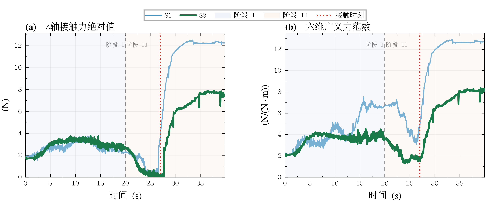
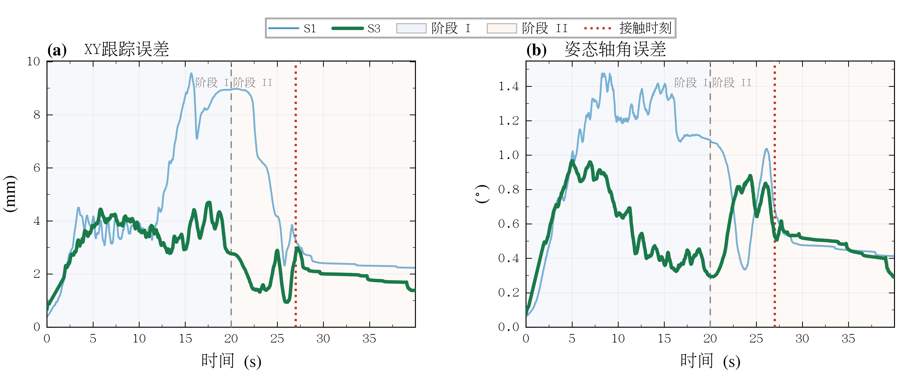

# Franka Experiment Documentation

<div class="hero-grid">
  <div class="hero-copy">
    <p class="hero-eyebrow">Franka ROS1 / On-Orbit 2.0</p>
    <h1 class="hero-title">先把系统跑起来，再看可视化，最后一键出论文图</h1>
    <p class="hero-lead">
      这份文档不再从包列表开始，而是直接给出你真正会复制到终端里的命令。适合论文展示、项目演示和新成员快速上手。
    </p>
    <ul class="hero-points">
      <li>容器启动、编译、实验 launch 的最短路径</li>
      <li>Foxglove 运行时可视化与关键 topic 观察入口</li>
      <li>闭环实验结束后，一条命令生成 publication 级对比图</li>
    </ul>
    <div class="hero-actions">
      <a class="md-button md-button--primary" href="#30-秒跑起来">30 秒跑起来</a>
      <a class="md-button" href="quickstart.md">完整快速开始</a>
      <a class="md-button" href="plotting.md">绘图与后处理</a>
    </div>
  </div>
  <div class="hero-preview">
    <div class="hero-panel">
      
      <p class="panel-caption">终端演示：启动容器、运行闭环实验、导出论文图。</p>
    </div>
    <div class="hero-panel">
      
      <p class="panel-caption">可视化演示：Foxglove 连接、模式状态、控制器调试与轨迹预览。</p>
    </div>
  </div>
</div>

## 30 秒跑起来

<p class="section-kicker">Quick Start</p>

<div class="step-grid">
  <div class="step-card" markdown="1">
    <div class="step-index">1</div>
    <h3>进入容器并编译</h3>
    <p>所有 ROS1 与 Franka 依赖都放在容器里，先把工作区编译起来。</p>
    <div class="quick-command" markdown="1">

```bash
docker compose up --build -d
docker exec -it ros1-franka bash
source /opt/ros/noetic/setup.bash
cd /workspace && catkin_make
source /workspace/devel/setup.bash
```

    </div>
  </div>
  <div class="step-card" markdown="1">
    <div class="step-index">2</div>
    <h3>启动实验主入口</h3>
    <p>先用手动实验检查系统状态；做自动实验时直接切到闭环 launch。</p>
    <div class="quick-command" markdown="1">

```bash
roslaunch on_orbit_bringup manual_experiment.launch \
  launch_visualization:=true \
  start_foxglove_bridge:=true

roslaunch on_orbit_bringup closed_loop_experiment.launch
```

    </div>
  </div>
  <div class="step-card" markdown="1">
    <div class="step-index">3</div>
    <h3>一键生成结果图</h3>
    <p>闭环实验结束后，直接生成论文中可用的对比图，不需要单独再跑清洗脚本。</p>
    <div class="quick-command" markdown="1">

```bash
python3 /workspace/src/on_orbit_apps/scripts/plot_experiment_publication.py
ls -lah /workspace/closed/publication
```

    </div>
  </div>
</div>

## 终端启动演示

<p class="section-kicker">Terminal Demo</p>

<div class="media-grid">
  <div class="media-card" markdown="1">
    
    <h3>你最常用的命令序列</h3>
    <p class="media-caption">从 <code>docker compose up</code> 到 <code>closed_loop_experiment.launch</code>，再到 <code>plot_experiment_publication.py</code>，首页直接给出最常用链路。</p>
  </div>
  <div class="media-card" markdown="1">
    <h3>常复制的一组命令</h3>

```bash
docker compose up --build -d
docker exec -it ros1-franka bash
source /workspace/devel/setup.bash
roslaunch on_orbit_bringup closed_loop_experiment.launch
python3 /workspace/src/on_orbit_apps/scripts/plot_experiment_publication.py
```

    <p class="media-caption">如果你只想知道“怎么最快跑通一遍”，这一组命令就够了。</p>
  </div>
</div>

## Foxglove 可视化演示

<p class="section-kicker">Runtime Visualization</p>

<div class="media-grid">
  <div class="media-card">
    
    <h3>运行时状态一眼看全</h3>
    <p class="media-caption">推荐直接连 <code>ws://localhost:8765</code>，同时观察 ModeState、PlannerStatus、ControllerDebug 和 active reference pose。</p>
  </div>
  <div class="media-card">
    <h3>启动与连接</h3>

```bash
roslaunch on_orbit_bringup manual_experiment.launch \
  launch_visualization:=true \
  start_foxglove_bridge:=true
```

```text
ws://localhost:8765
```

    <p class="media-caption">详细 topic 与调试字段说明见 <a href="observability.md">观测与日志</a> 和 <a href="debug-topics.md">Debug Topics</a>。</p>
  </div>
</div>

## 一键生成实验结果

<p class="section-kicker">Publication Figures</p>

```bash
python3 /workspace/src/on_orbit_apps/scripts/plot_experiment_publication.py
```

<div class="result-grid">
  <div class="result-card">
    
    <h3>力响应对比图</h3>
    <p class="result-note">左图为 Z 轴接触力绝对值，右图为六维广义力范数。</p>
  </div>
  <div class="result-card">
    
    <h3>跟踪误差对比图</h3>
    <p class="result-note">左图为 XY 跟踪误差，右图为姿态轴角误差。</p>
  </div>
</div>

输出目录：

```text
/workspace/closed/publication/
```

如果你需要改对齐方式、阶段线和接触线，直接看 [绘图与后处理](plotting.md)。

## 继续往下看什么

<div class="link-grid">
  <div class="link-card">
    <h3><a href="quickstart.md">快速开始</a></h3>
    <p>环境变量、容器、编译、launch 入口与 planner_demo 命令全集。</p>
  </div>
  <div class="link-card">
    <h3><a href="commands.md">运行与命令</a></h3>
    <p>常用 roslaunch、rosrun、日志查看与 supervisor 切换命令。</p>
  </div>
  <div class="link-card">
    <h3><a href="observability.md">观测与日志</a></h3>
    <p>Foxglove、RViz、ControllerDebug 以及实验日志目录结构。</p>
  </div>
  <div class="link-card">
    <h3><a href="architecture.md">架构总览</a></h3>
    <p>如果你已经能跑起来，再回来看系统链路和模块分工会更顺。</p>
  </div>
</div>
